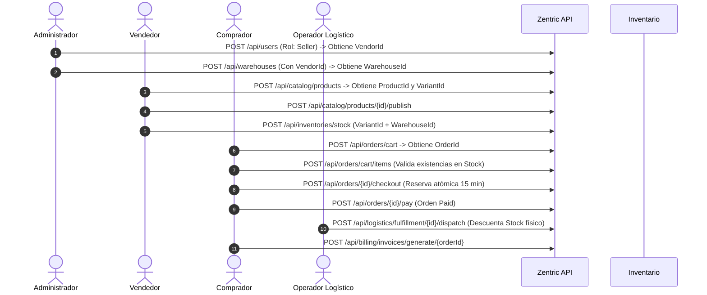

# Zentric Marketplace — Backend API Core

[](https://dotnet.microsoft.com/)
[](https://learn.microsoft.com/dotnet/csharp/)
[](https://www.postgresql.org/)
[](https://www.docker.com/)
[-brightgreen?style=for-the-badge&logo=xunit)](https://xunit.net/)
[](./SDD/02-software-architecture.md)
[](./.agents/skills/generic-sdd-agent/SKILL.md)

API Central y Núcleo de Dominio para la plataforma de comercio electrónico y marketplace **Zentric**. Diseñada para orquestar la operación comercial integral entre compradores y vendedores: gestión de usuarios, catálogos multi-proveedor, bodegas físicas, inventarios distribuidos, carritos, reservas temporales de stock, paquetería logística, garantías/devoluciones y liquidación financiera.

---

## 📑 Tabla de Contenidos
1. [Visión General del Negocio](#-visión-general-del-negocio)
2. [Las Dos Biblias y Metodología SDD](#-las-dos-biblias-y-metodología-sdd)
3. [Arquitectura del Sistema (Hexagonal + DDD + CQRS)](#-arquitectura-del-sistema)
4. [Los 10 Módulos de Dominio](#-los-10-módulos-de-dominio)
5. [Contrato de API REST y Catálogo de Endpoints](#-contrato-de-api-rest-y-catálogo-de-endpoints)
6. [Flujo Operativo de Negocio (Paso a Paso)](#-flujo-operativo-de-negocio-paso-a-paso)
7. [Documentación Interactiva (Swagger y Postman)](#-documentación-interactiva-swagger-y-postman)
8. [Instalación y Despliegue](#-instalación-y-despliegue)
9. [Pruebas Automatizadas y Calidad](#-pruebas-automatizadas-y-calidad)
10. [Convenciones de Commits por Etapas](#-convenciones-de-commits-por-etapas)

---

## 🏢 Visión General del Negocio

**Zentric** actúa como intermediario tecnológico y comercial. El sistema garantiza trazabilidad total, consistencia transaccional y cumplimiento estricto de las invariantes de negocio:
- **Catálogo y Publicación:** Productos físicos (con control dimensional y variantes de SKU obligatorias) y digitales.
- **Inventario Distribuido:** Control de stock por bodega diferenciando existencias *Nuevas* y *Usadas*, reservas atómicas y auditoría contra stock fantasma.
- **Ciclo de Pedidos:** Carrito de compras, checkout con reserva automática de 15 minutos (`CheckoutTimeoutService`) y confirmación de pago.
- **Fulfillment Logístico:** Agrupación y partición de despachos por vendedor (`VendorId`), despacho físico y reversión de existencias.
- **Posventa y Garantías:** Solicitudes dentro de garantía legal, inspección física en bodega y reingreso automático al stock usado vía eventos de dominio (`ReturnApprovedEvent`).
- **Facturación:** Emisión de Factura Maestra consolidada para el comprador, desglose de comisión Zentric (`ZentricDetail`) y facturas split por vendedor.

---

## 📖 Las Dos Biblias y Metodología SDD

El desarrollo de este backend se rige bajo **Spec-Driven Development (SDD v6.0.0)**. En esta metodología, **sin especificación previa no existe código**:

| Fuente | Documento | Propósito |
| :--- | :--- | :--- |
| **Ley del Negocio (Biblia 1)** | [`ZENTRIC.md`](./ZENTRIC.md) | Requerimientos funcionales, participantes, objetivos (OBJ-01 a OBJ-12) y reglas inviolables del cliente. Intocable sin autorización expresa del Owner. |
| **Metodología Operativa (Biblia 2)** | [`.agents/skills/generic-sdd-agent/SKILL.md`](./.agents/skills/generic-sdd-agent/SKILL.md) | Guía universal de ingeniería de software, freno de mano ante ambigüedades, sincronización bidireccional y cero suposiciones. |
| **Contrato del Repositorio** | [`AGENTS.md`](./AGENTS.md) | Reglas arquitectónicas de aislamiento, tratamiento de errores (RFC 7807) y Definition of Done (DoD). |
| **Memoria Viva y SSoT** | [`SDD/SDD.md`](./SDD/SDD.md) y [`SDD/`](./SDD/) | Catálogo de las 33 entidades mapeadas, 6 ADRs aprobados, matriz de riesgos y especificaciones por capa. |

---

## 🏛 Arquitectura del Sistema

La solución adopta **Arquitectura Hexagonal (Puertos y Adaptadores)** combinada con **Domain-Driven Design (DDD)** táctico y segregación de responsabilidades mediante **CQRS**:

```
                              ┌────────────────────────────────────────────────┐
                              │            Presentation (Zentric.Api)          │
                              │  - 8 Controladores REST con ProblemDetails     │
                              │  - Swagger UI / OpenAPI v1 (Esquema Bearer)    │
                              └──────────────────────┬─────────────────────────┘
                                                     │ (HTTP Requests)
                                                     ▼
                              ┌────────────────────────────────────────────────┐
                              │         Application (Zentric.Application)      │
                              │  - CQRS: Commands (Mutación) & Queries (Lectura│
                              │  - Pipeline de Validación (FluentValidation)   │
                              │  - Puertos de Salida (IUnitOfWork, Events)     │
                              └──────────────────────┬─────────────────────────┘
                                                     │ (Dependencia Estricta)
                                                     ▼
┌───────────────────────────────┐     ┌────────────────────────────────────────────────┐
│ Infrastructure (Tecnología)   │     │            Domain (Zentric.Domain)             │
│ - EF Core 10 & PostgreSQL     │◄────┤  - Entidades y Agregados sin Setters Anémicos  │
│ - DbModels Aislados y Mappers │(Imp)│  - Value Objects Inmutables (Money, Email, Sku)│
│ - IDomainEventDispatcher      │     │  - Invariantes de Negocio y Reglas Puras       │
│ - CheckoutTimeoutService      │     │  - Puertos de Repositorio (Interfaces puras)   │
└───────────────────────────────┘     └────────────────────────────────────────────────┘
```

### Principios Arquitectónicos Clave:
1. **Dominio Puro:** `Zentric.Domain` no tiene dependencias de NuGet, frameworks web ni EF Core. Sus entidades tienen identidad, encapsulación estricta y métodos de negocio expresivos.
2. **Aislamiento en Persistencia (Anti-Fuga):** En `Zentric.Infrastructure`, las entidades de EF Core son `DbModels` dedicados (ej. `UserDbModel`, `ProductDbModel`), mapeados bidireccionalmente hacia el dominio mediante mappers puros.
3. **Pipeline CQRS:** Los comandos que mutan estado se envían a través de MediatR y son interceptados por `ValidationBehavior` para validar reglas de formato y negocio antes de tocar el dominio.
4. **Respuestas Problem Details (RFC 7807):** Ninguna excepción catastrófica o fallo de negocio se expone con stacktraces técnicos; se mapean a esquemas de error estandarizados.

---

## 📦 Los 10 Módulos de Dominio

| # | Módulo | Agregado / Entidad Raíz | Invariante Central |
| :---: | :--- | :--- | :--- |
| **1** | **Usuarios y Roles** | `User` | Unicidad obligatoria de email y cédula (`IdentityDocument`). Roles definidos: Buyer, Seller, Administrator, LogisticsOperator, Supervisor. |
| **2** | **Gestión de Bodegas** | `Warehouse` | Capacidad volumétrica positiva ($m^3$). Bodegas de Vendor deben tener `VendorId`; bodegas de Marketplace no pueden tenerlo. |
| **3** | **Inventario Distribuido** | `Inventory` | Prohibido el stock negativo. Control atómico de existencias disponibles, reservadas, usadas y dañadas por bodega y SKU. |
| **4** | **Catálogo de Productos** | `Product` & `ProductVariant` | Productos físicos exigen variantes obligatorias (SKUs). Ciclo de vida estricto: `Draft` -> `Published` -> `Suspended`. |
| **5** | **Carrito y Órdenes** | `CustomerOrder` & `OrderItem` | Carrito no puede hacer checkout si está vacío. Temporizador de 15 minutos para formalizar el pago antes de expirar reservas. |
| **6** | **Fulfillment Logístico** | `FulfillmentOrder` & `Shipment` | Paquetes agrupados por vendedor. Despacho descuenta stock físico; reporte de stock fantasma cancela paquete y libera reserva. |
| **7** | **Devoluciones** | `ReturnRequest` | Prohibidas en productos digitales. Inspección técnica previa obligatoria; al aprobar, reingresa automáticamente como stock *Usado*. |
| **8** | **Facturación Comercial** | `Invoice` | Factura Maestra por el total pagado, Factura Zentric por comisión de plataforma y Factura Split por cada vendedor. |
| **9** | **Timeout de Carritos** | `CheckoutTimeoutService` | Servicio en segundo plano (`BackgroundService`) que barre periódicamente órdenes en checkout expiradas y libera reservas. |
| **10** | **Eventos de Dominio** | `IDomainEventDispatcher` | Despacho reactivo de eventos (`ReturnApprovedEvent`, `OrderPaidDomainEvent`) desacoplado en la transacción de persistencia. |

---

## 🔌 Contrato de API REST y Catálogo de Endpoints

La API cuenta con **26 endpoints** organizados en 8 Bounded Contexts, cubriendo tanto los **Comandos (Mutaciones `POST`)** como las **Consultas (Lecturas `GET`)**:

### 1. Usuarios y Roles (`/api/users`)
- `POST /api/users`: Registro de usuario (valida unicidad de email y documento).
- `GET /api/users`: Lista de usuarios (filtro opcional `?role=Seller` o `?role=Buyer`).
- `GET /api/users/{id}`: Consulta de usuario por ID.

### 2. Bodegas (`/api/warehouses`)
- `POST /api/warehouses`: Alta de bodega física con capacidad volumétrica.
- `GET /api/warehouses`: Lista de bodegas (filtro opcional `?vendorId=...`).
- `GET /api/warehouses/{id}`: Detalle de bodega por ID.

### 3. Inventario y Stock (`/api/inventories`)
- `POST /api/inventories/stock`: Ingreso y actualización de existencias nuevas y usadas.
- `GET /api/inventories/{variantId}`: Consulta de existencias físicas y reservas por SKU en cada bodega.

### 4. Catálogo de Productos (`/api/catalog`)
- `POST /api/catalog/products`: Creación de ficha técnica de producto en borrador (`Draft`).
- `POST /api/catalog/products/{id}/publish`: Publicación de producto para venta pública.
- `GET /api/catalog/products`: Catálogo público con precios y variantes (filtro `?vendorId=...`).
- `GET /api/catalog/products/{id}`: Ficha técnica detallada de producto por ID.

### 5. Carrito y Órdenes (`/api/orders`)
- `POST /api/orders/cart`: Inicializa un carrito para un comprador (`BuyerId`).
- `POST /api/orders/cart/items`: Añade productos validando stock disponible en tiempo real.
- `POST /api/orders/{id}/checkout`: Cierra el carrito, reserva existencias por 15 min y genera paquetes.
- `POST /api/orders/{id}/pay`: Confirma el pago de la orden y consolida reservas para empaque.
- `GET /api/orders/{id}`: Consulta estado de orden (`Cart`, `PendingPayment`, `Paid`), total e ítems.

### 6. Logística y Despacho (`/api/logistics`)
- `POST /api/logistics/fulfillment`: Creación de orden de empaque por vendedor y bodega.
- `POST /api/logistics/fulfillment/{id}/dispatch`: Marca como despachado y descuenta stock físico.
- `POST /api/logistics/fulfillment/cancel-ghost-stock`: Cancela paquete por stock fantasma y libera reserva.
- `GET /api/logistics/fulfillment/{id}`: Detalle del paquete logístico y números de guía.

### 7. Devoluciones y Garantías (`/api/returns`)
- `POST /api/returns/request`: Radica solicitud de devolución dentro de garantía.
- `POST /api/returns/{id}/inspect`: Registra dictamen técnico (buen estado o dañado).
- `POST /api/returns/{id}/approve`: Aprueba devolución y reingresa stock usado automáticamente.
- `GET /api/returns/{id}`: Detalle y estado de la solicitud de devolución.

### 8. Facturación y Liquidación (`/api/billing`)
- `POST /api/billing/invoices/generate/{orderId}`: Genera Factura Maestra y comisión Zentric.
- `GET /api/billing/invoices/order/{orderId}`: Consulta todas las facturas emitidas para la orden.

---

## 🔄 Flujo Operativo de Negocio (Paso a Paso)

Para probar la plataforma de forma integral en Swagger UI o Postman, sigue esta secuencia cronológica:



---

## 🚀 Instalación y Despliegue

### Requisitos Previos
- [.NET 10 SDK](https://dotnet.microsoft.com/download/dotnet/10.0)
- [PostgreSQL 16](https://www.postgresql.org/) (o Docker)
- [Docker & Docker Compose](https://www.docker.com/)

### Opción 1: Despliegue con Docker Compose (Recomendado)
Levanta la base de datos PostgreSQL 16 y la API en contenedores aislados:
```powershell
docker compose up -d --build
```
La API quedará escuchando en `http://localhost:8080/swagger`.

### Opción 2: Ejecución Local Nativa
1. Clona el repositorio y restaura dependencias:
   ```powershell
   git clone https://github.com/D-MachadoDev/zentric-backend.git
   cd zentric-backend
   dotnet restore Zentric.slnx
   ```
2. Configura tu cadena de conexión en `Zentric.Api/appsettings.Development.json`:
   ```json
   "ConnectionStrings": {
     "DefaultConnection": "Host=localhost;Port=5432;Database=zentric;Username=postgres;Password=postgres"
   }
   ```
3. Ejecuta el backend:
   ```powershell
   dotnet run --project Zentric.Api/Zentric.Api.csproj
   ```
4. Abre en tu navegador: **`http://localhost:5000/swagger`**.

---

## 📮 Documentación Interactiva (Swagger y Postman)

### Swagger UI Interactivo
- **Ruta:** `http://localhost:5000/swagger`
- **Esquema Bearer JWT:** Incluye el botón interactivo **Authorize** en la parte superior derecha para enviar cabeceras `Authorization: Bearer <token>` cuando el módulo de autenticación sea consumido por el frontend.
- **Documentación XML:** Cada endpoint incluye descripciones de negocio, parámetros obligatorios y contratos de respuesta tipados.

### Importar la Colección en Postman
1. Abre Postman y selecciona **Import**.
2. Ingresa la URL: `http://localhost:5000/swagger/v1/swagger.json`.
3. Postman importará automáticamente todos los endpoints organizados en carpetas por Bounded Contexts, listos para pruebas con ejemplos JSON.

---

## 🧪 Pruebas Automatizadas y Calidad

El proyecto cuenta con una batería de **235 pruebas unitarias** que evalúan el 100% de las invariantes de negocio, servicios de dominio, manejadores CQRS y validaciones:

```powershell
dotnet test Zentric.slnx
```

```
Passed!  - Failed: 0, Passed: 235, Skipped: 0, Total: 235, Duration: 311 ms - Zentric.Tests.dll (net10.0)
```

---

## 📋 Convenciones de Commits por Etapas

Para preservar la trazabilidad entre el código y la especificación SDD, los commits se estructuran bajo el estándar [Conventional Commits](https://www.conventionalcommits.org/):

| Etapa | Formato de Commit | Ejemplo Real |
| :--- | :--- | :--- |
| **Especificación (SDD)** | `docs(sdd): <alcance>` | `docs(sdd): definir catalogo de queries cqrs y endpoints de lectura` |
| **Dominio Puro** | `feat(domain): <entidad>` | `feat(domain): agregar invariantes de tiempo de espera y reserva` |
| **Aplicación (CQRS)** | `feat(application): <caso-de-uso>` | `feat(application): implementar getusersquery y getwarehousesquery` |
| **Infraestructura** | `feat(infra): <adaptador>` | `feat(infra): aislar modelos db de persistencia y agregar repositorios` |
| **Presentación (API)** | `feat(api): <controlador>` | `feat(api): exponer consultas get y documentar con swagger ui` |
| **Mantenimiento** | `chore: <descripción>` | `chore: depurar artefactos transitorios y unificar namespaces` |

---

## 👥 Equipo y Créditos
- **Organización:** Zentric Marketplace
- **Repositorio:** [github.com/D-MachadoDev/zentric-backend](https://github.com/D-MachadoDev/zentric-backend.git)
- **Licencia:** MIT
