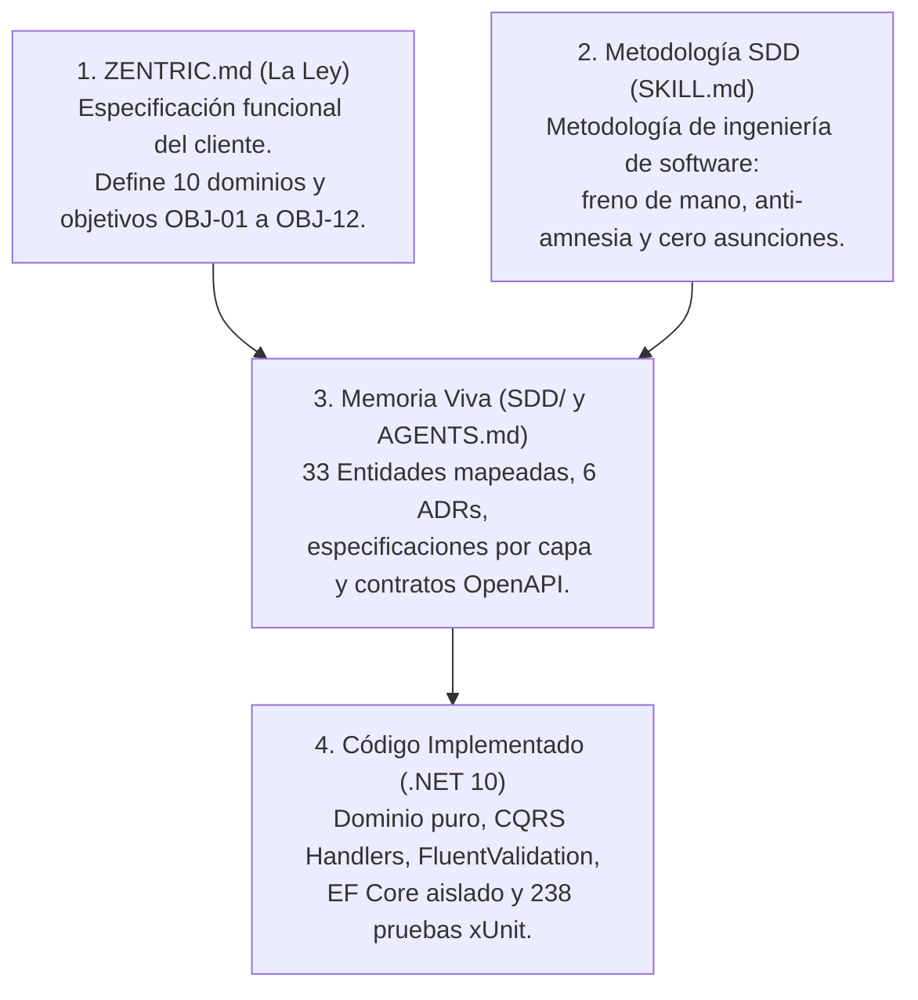
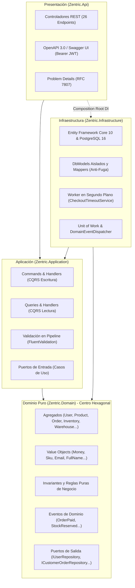
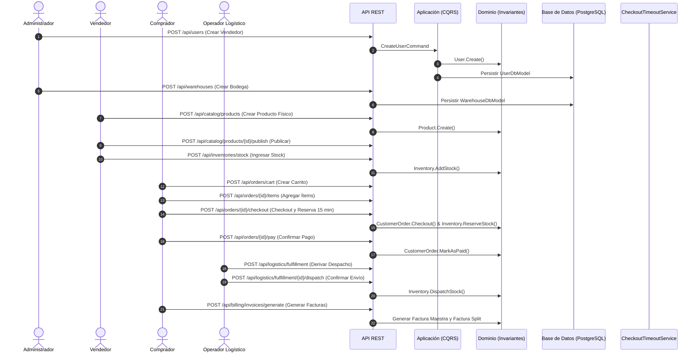

# Zentric Marketplace — Backend Core & Domain API

[](https://dotnet.microsoft.com/)
[](https://learn.microsoft.com/dotnet/csharp/)
[](https://www.postgresql.org/)
[](https://www.docker.com/)
[-brightgreen?style=for-the-badge&logo=xunit)](https://xunit.net/)
[](./SDD/02-software-architecture.md)
[](./.agents/skills/generic-sdd-agent/SKILL.md)
[](./LICENSE)

Núcleo de Dominio y API Central para la plataforma de comercio electrónico y marketplace **Zentric**. Diseñada bajo principios de ingeniería de software empresarial: **Arquitectura Hexagonal (Puertos y Adaptadores)**, **Domain-Driven Design (DDD)** táctico, segregación de responsabilidades con **CQRS**, y gobernada mediante **Spec-Driven Development (SDD)**.

---

## 📑 Tabla de Contenidos
1. [Inicio Rápido (Quick Start)](#-inicio-rápido-quick-start)
2. [Visión General del Negocio](#-visión-general-del-negocio)
3. [Estructura de Especificación (SDD)](#-estructura-de-especificación-sdd)
4. [Arquitectura del Sistema (Hexagonal + DDD + CQRS)](#-arquitectura-del-sistema)
5. [Modelado Táctico de Dominio y Lenguaje Ubicuo](#-modelado-táctico-de-dominio-y-lenguaje-ubicuo)
6. [Registro de Decisiones Arquitectónicas (ADRs)](#-registro-de-decisiones-arquitectónicas-adrs)
7. [Contrato de API REST y Catálogo de Endpoints](#-contrato-de-api-rest-y-catálogo-de-endpoints)
8. [Flujo Operativo de Negocio](#-flujo-operativo-de-negocio)
9. [Tratamiento Estandarizado de Errores (RFC 7807)](#-tratamiento-estandarizado-de-errores-rfc-7807)
10. [Instalación y Despliegue](#-instalación-y-despliegue)
11. [Pruebas Automatizadas y Calidad](#-pruebas-automatizadas-y-calidad)
12. [Matriz de Trazabilidad Técnica y Arquitectura](#-matriz-de-trazabilidad-técnica-y-arquitectura)

---

## ⚡ Inicio Rápido (Quick Start)

El entorno completo está contenerizado para permitir su ejecución inmediata:

```bash
# 1. Clonar el repositorio
git clone https://github.com/D-MachadoDev/zentric-backend.git
cd zentric-backend

# 2. Iniciar PostgreSQL 16 y la API en contenedores
docker compose up -d --build

# 3. Acceder a la documentación interactiva en el navegador:
# http://localhost:5076/swagger
```

Para ejecutar la suite de pruebas automatizadas en local (.NET 10 SDK):
```bash
dotnet test Zentric.slnx
```

---

## 🏢 Visión General del Negocio

**Zentric** gestiona la operación integral de un marketplace multi-vendedor con logística e inventarios distribuidos:
- **Consistencia de Inventario:** Control atómico de existencias por bodega física y variante (SKU), evitando sobreventa y quiebres por stock fantasma.
- **Reserva Preventiva:** Retención automática de stock en el checkout con expiración reglamentaria de **15 minutos** (`CheckoutTimeoutService`) si no se confirma el pago ([PED-01](./SDD/Domain/06-business-rules.md)).
- **Logística (Fulfillment):** Partición y despacho de órdenes agrupadas por vendedor y bodega.
- **Posventa y Garantías:** Solicitudes de devolución con validación de garantía, inspección técnica en bodega y reingreso al inventario clasificado como *Usado*.
- **Facturación:** Emisión de Factura Maestra consolidada para el comprador, Factura Detalle por cada vendedor y liquidación de comisión de plataforma.

---

## 📖 Estructura de Especificación (SDD)

El desarrollo del proyecto se rige por **Spec-Driven Development (SDD v6.0.0)**, manteniendo sincronización bidireccional entre la especificación y el código fuente:



| Nivel de Verdad | Documento | Propósito |
| :--- | :--- | :--- |
| **Nivel 1: La Biblia (La Ley)** | [`ZENTRIC.md`](./ZENTRIC.md) | Documento funcional original. Intocable en su redacción. En su §3.2 excluye explícitamente bases de datos, UI y tecnologías de implementación. |
| **Nivel 2: Addenda del Owner** | [`ADD-001` a `ADD-003`](./SDD/SDD.md#addendum---dictado-por-owner) | Resoluciones dictadas por el Owner ante aspectos no especificados en el documento original. |
| **Nivel 3: Decisiones de Arquitectura** | [`ADR-0001` a `ADR-0006`](./SDD/Adr/) | Registros de decisiones de diseño de software (reserva atómica, VariantId, carritos, etc.). |
| **Nivel 4: Memoria Viva (SSoT)** | [`SDD/SDD.md`](./SDD/SDD.md) y [`SDD/`](./SDD/) | Fuente Única de Verdad técnica que indexa modelos, invariantes, puertos y contratos. |
| **Nivel 5: Implementación Técnica** | Código Fuente C# | Implementación concreta estructurada en 5 proyectos. |

---

## 🏛 Arquitectura del Sistema

La solución adopta **Arquitectura Hexagonal (Puertos y Adaptadores)** con **Domain-Driven Design (DDD)** y **CQRS (Command Query Responsibility Segregation)**:



### Reglas Arquitectónicas
1. **Aislamiento de Dominio:** `Zentric.Domain` no contiene dependencias de paquetes NuGet externos, frameworks web ni librerías de persistencia.
2. **Aislamiento de Persistencia:** En `Zentric.Infrastructure`, EF Core utiliza modelos dedicados (`*DbModel`) y mapeadores explícitos (`*Mapper`), evitando anotaciones o setters anémicos en las entidades de dominio.
3. **Controladores Delgados:** Los controladores reciben las solicitudes HTTP, delegan la ejecución a los comandos/queries correspondientes mediante MediatR y devuelven respuestas RESTful consistentes.
4. **Validación en Pipeline:** `ValidationBehavior` intercepta cada comando antes de su ejecución, validando restricciones con FluentValidation.

---

## 📦 Modelado Táctico de Dominio y Lenguaje Ubicuo

El sistema define 9 Agregados Raíz alineados con el Glosario de Términos del dominio:

| Agregado / Entidad | Bounded Context | Invariante Central | Ubicación en Código |
| :--- | :--- | :--- | :--- |
| **`User`** | Identity | Unicidad obligatoria de email. Rol único asignado (Buyer, Seller, Admin, Logistics, Supervisor). | [`User.cs`](./Zentric.Domain/Users/User.cs) |
| **`Warehouse`** | Logistics / Inventory | Capacidad volumétrica positiva. Bodega de vendedor requiere `VendorId`; de marketplace lo prohíbe. | [`Warehouse.cs`](./Zentric.Domain/Warehouses/Warehouse.cs) |
| **`Product`** | Catalog | Productos físicos requieren variantes (SKUs). Estados: Draft, Published, Suspended. | [`Product.cs`](./Zentric.Domain/Products/Product.cs) |
| **`ProductVariant`** | Catalog | SKU único, dimensiones físicas y atributos inmutables (`VariantAttribute`). | [`ProductVariant.cs`](./Zentric.Domain/Products/ProductVariant.cs) |
| **`Inventory`** | Inventory | Prohibido el stock negativo. Contadores atómicos: `Available`, `Reserved`, `Used`, `Damaged`. | [`Inventory.cs`](./Zentric.Domain/Inventories/Inventory.cs) |
| **`CustomerOrder`** | Ordering | Carrito de compras, cálculo en moneda homogénea (`Money`), checkout con timeout de 15 min. | [`CustomerOrder.cs`](./Zentric.Domain/Orders/CustomerOrder.cs) |
| **`FulfillmentOrder`**| Fulfillment | Despacho agrupado por vendedor. Confirmación de envío (`Shipment`) y cancelación por quiebre. | [`FulfillmentOrder.cs`](./Zentric.Domain/Logistics/FulfillmentOrder.cs) |
| **`ReturnRequest`** | Returns / Post-Sale | Doble aprobación técnica y comercial. Prohibido para productos digitales. | [`ReturnRequest.cs`](./Zentric.Domain/Returns/ReturnRequest.cs) |
| **`Invoice`** | Billing | Emisión de Factura Maestra y Facturas Detalle por vendedor con desglose de comisión. | [`Invoice.cs`](./Zentric.Domain/Billing/Invoice.cs) |

### Value Objects Inmutables
- **`Money`:** Importe decimal y divisa ISO 4217 ("USD"). Controla que las operaciones aritméticas se realicen sobre la misma moneda.
- **`Email`:** Normalización y validación de formato.
- **`FullName`:** Nombres y apellidos con validación de longitud.
- **`VariantAttribute`:** Pares de atributo-valor (Talla, Color, etc.).

---

## 📑 Registro de Decisiones Arquitectónicas (ADRs)

Las decisiones de diseño técnico se encuentran documentadas en [`SDD/Adr/`](./SDD/Adr/):

| ADR | Título | Resumen de Decisión |
| :---: | :--- | :--- |
| **[ADR-0001](./SDD/Adr/0001-reserva-fragmentacion-contingencia.md)** | Reserva, Fraccionamiento y Contingencia | Reserva atómica en checkout. Ante quiebre por stock fantasma, cancelación parcial y liberación de existencias. |
| **[ADR-0002](./SDD/Adr/0002-clave-inventario-variantid.md)** | Clave de Inventario por `VariantId` | El inventario se controla a nivel de SKU (`VariantId`) para permitir existencias independientes por variante. |
| **[ADR-0003](./SDD/Adr/0003-variante-obligatoria-productos-fisicos.md)** | Variante Obligatoria en Productos Físicos | Los productos físicos requieren al menos una variante con datos dimensionales para publicarse. |
| **[ADR-0004](./SDD/Adr/0004-estado-cancelacion-despacho.md)** | Cancelación en Despachos Logísticos | Uso del estado `Cancelled` en `FulfillmentOrder` acompañado de `CancellationReason`. |
| **[ADR-0005](./SDD/Adr/0005-modelado-carrito-compras.md)** | Modelado de Carrito en `CustomerOrder` | El carrito se modela como el estado inicial (`Cart`) del agregado `CustomerOrder`. |
| **[ADR-0006](./SDD/Adr/0006-resolucion-contradiccion-ley-addendum.md)** | Prevalencia Normativa de Addendum | Aplicación de la regla dictada por el Owner para la partición de facturas y despachos por vendedor. |

---

## 🔌 Contrato de API REST y Catálogo de Endpoints

La API expone **26 endpoints RESTful** organizados por Bounded Context:

### Identity & Access (`UsersController`)
- `POST /api/users` — Registra un usuario con rol asignado.
- `GET /api/users` — Consulta la lista de usuarios.
- `GET /api/users/{id}` — Consulta el detalle de un usuario por ID.

### Warehouses (`WarehousesController`)
- `POST /api/warehouses` — Registra una bodega (Marketplace o Seller).
- `GET /api/warehouses` — Lista todas las bodegas.
- `GET /api/warehouses/{id}` — Consulta la información de una bodega por ID.

### Catalog (`CatalogController`)
- `POST /api/catalog/products` — Crea un producto en borrador con variantes y atributos.
- `POST /api/catalog/products/{id}/publish` — Publica un producto validando sus invariantes.
- `GET /api/catalog/products` — Consulta el catálogo de productos disponibles.
- `GET /api/catalog/products/{id}` — Consulta el detalle y SKUs de un producto.

### Inventories (`InventoriesController`)
- `POST /api/inventories/stock` — Registra ingreso o reposición de stock.
- `GET /api/inventories/variants/{variantId}` — Consulta existencias por SKU (disponible, reservado, usado, dañado).

### Ordering (`OrdersController`)
- `POST /api/orders/cart` — Inicializa un carrito de compras.
- `POST /api/orders/{id}/items` — Agrega variantes y cantidades al carrito.
- `POST /api/orders/{id}/checkout` — Ejecuta el checkout y activa la reserva de 15 minutos.
- `POST /api/orders/{id}/pay` — Registra el pago y confirma el pedido.
- `GET /api/orders/{id}` — Consulta el estado y detalle de un pedido.

### Logistics & Fulfillment (`LogisticsController`)
- `POST /api/logistics/fulfillment` — Deriva la orden de despacho al vendedor.
- `POST /api/logistics/fulfillment/{id}/dispatch` — Despacha el paquete y asigna número de guía.
- `POST /api/logistics/fulfillment/{id}/cancel-no-stock` — Cancela por quiebre de stock y libera reservas.
- `GET /api/logistics/fulfillment/{id}` — Consulta el estado del despacho.

### Returns & Post-Sale (`ReturnsController`)
- `POST /api/returns/request` — Registra solicitud de devolución en periodo de garantía.
- `POST /api/returns/{id}/inspect` — Registra el resultado de la inspección física.
- `POST /api/returns/{id}/approve` — Aprueba la devolución y reingresa el ítem al stock usado.
- `GET /api/returns/{id}` — Consulta el estado de una devolución.

### Billing (`BillingController`)
- `POST /api/billing/invoices/generate` — Emite Factura Maestra y facturas split por vendedor.
- `GET /api/billing/invoices/by-order/{orderId}` — Consulta las facturas vinculadas a un pedido.

---

## 🔄 Flujo Operativo de Negocio



---

## 🛡 Tratamiento Estandarizado de Errores (RFC 7807)

La API implementa respuestas estandarizadas bajo **RFC 7807 (Problem Details)**:
- Respuestas `400 Bad Request` / `422 Unprocessable Entity` para fallos de validación o infracciones de reglas de negocio.
- Respuestas `404 Not Found` para identificadores inexistentes.
- Respuestas `500 Internal Server Error` controladas por el middleware global sin exponer detalles internos de la base de datos.

### Ejemplo de Respuesta:
```json
{
  "type": "https://tools.ietf.org/html/rfc7807",
  "title": "Business Rule Violation",
  "status": 400,
  "detail": "Physical products must have at least one variant (SKU) before being published.",
  "instance": "/api/catalog/products/6b579128-d760-449e-b52b-7c458319f012/publish",
  "code": "CATALOG_PHYSICAL_VARIANT_REQUIRED"
}
```

---

## 🚀 Instalación y Despliegue

### Despliegue con Docker Compose (Recomendado)
```bash
docker compose up -d --build
```
- **API REST & Swagger UI:** `http://localhost:5076/swagger`
- **Base de Datos PostgreSQL:** `localhost:5432` (Base de datos: `ZentricDb`)

Para detener los servicios:
```bash
docker compose down
```

### Ejecución Local con .NET 10 SDK
```bash
# Restaurar paquetes
dotnet restore Zentric.slnx

# Compilar solución
dotnet build Zentric.slnx

# Ejecutar proyecto API
dotnet run --project Zentric.Api/Zentric.Api.csproj
```

---

## 🧪 Pruebas Automatizadas y Calidad

El proyecto cuenta con **238 pruebas unitarias y de integración** ejecutadas con xUnit:

```bash
dotnet test Zentric.slnx
```

```text
Passed!  - Failed: 0, Passed: 238, Skipped: 0, Total: 238, Duration: 240 ms
```

### Alcance de las Pruebas:
- **Pruebas de Dominio:** Invariantes de catálogo, variantes obligatorias, cálculo con `Money`, control de stock distribuido, máquina de estados de pedidos, expiración por timeout (`CancelDueToTimeout`) y guardas de inmutabilidad en pedidos finalizados o cancelados.
- **Pruebas de Aplicación:** Ejecución de Command Handlers y Query Handlers, validaciones con FluentValidation y canalización con `ValidationBehavior`.

---

## 📊 Matriz de Trazabilidad Técnica y Arquitectura

La siguiente matriz indexa los componentes arquitectónicos y su ubicación en la base de código:

| Componente / Capacidad | Especificación y Requisitos | Ubicación en Código / Evidencia |
| :--- | :--- | :--- |
| **Metodología SDD** | Especificación previa formal sin asunciones; memoria viva del sistema. | [`ZENTRIC.md`](./ZENTRIC.md)<br/>[`SDD/`](./SDD/) |
| **Arquitectura Hexagonal** | Regla de dependencias estricta; núcleo de dominio sin dependencias externas. | [`Zentric.Domain/`](./Zentric.Domain/)<br/>[`SDD/02-software-architecture.md`](./SDD/02-software-architecture.md) |
| **Modelado DDD y Encapsulación** | Agregados con métodos de negocio semánticos; Value Objects inmutables. | [`Zentric.Domain/`](./Zentric.Domain/)<br/>[`SDD/Domain/`](./SDD/Domain/) |
| **Aislamiento de Persistencia** | Modelos `*DbModel` y `*Mapper` dedicados; Unit of Work. | [`Zentric.Infrastructure/Persistence/`](./Zentric.Infrastructure/Persistence/) |
| **Segregación CQRS** | Comandos y Consultas independientes; pipeline de validación. | [`Zentric.Application/`](./Zentric.Application/) |
| **Manejo de Errores** | Mapeo estructurado a RFC 7807 (Problem Details). | [`ApiControllerBase.cs`](./Zentric.Api/Controllers/ApiControllerBase.cs)<br/>[`Program.cs`](./Zentric.Api/Program.cs) |
| **Cobertura de Pruebas** | Suite de 238 pruebas automatizadas cubriendo casos de éxito y borde. | [`Zentric.Tests/`](./Zentric.Tests/) |
| **Contenerización** | Despliegue con Docker Compose (PostgreSQL 16 + API). | [`docker-compose.yml`](./docker-compose.yml)<br/>[`Dockerfile`](./Dockerfile) |
| **Documentación de API** | OpenAPI 3.0 con Swagger UI y esquema Bearer JWT. | [`Program.cs`](./Zentric.Api/Program.cs)<br/>[`SDD/Presentation/01-endpoints.md`](./SDD/Presentation/01-endpoints.md) |
| **Decisiones Técnicas** | Registro de 6 ADRs documentados bajo formato MADR. | [`SDD/Adr/`](./SDD/Adr/) |

---

*Nota: Para consultar el registro completo de cambios en el código, utilice el historial de Git (`git log`).*
