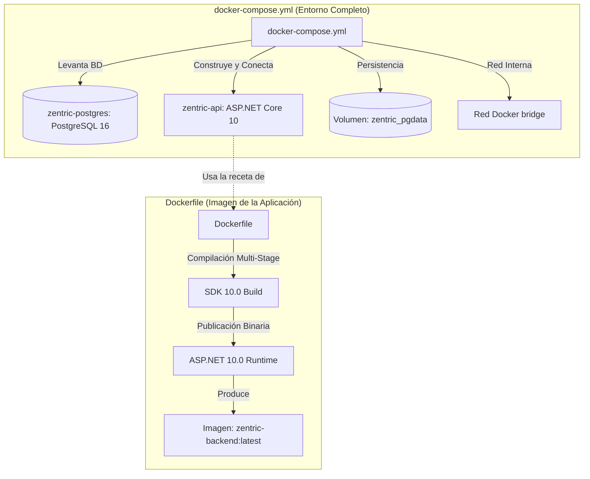

# Capa de Infraestructura — Contenedores y Despliegue (Docker)

> **Documento canónico SDD** para la definición técnica de empaquetado y orquestación de contenedores del proyecto `zentric-backend`.

---

## 1. Justificación y Propósito: ¿Por qué existen dos archivos Docker?

En el proyecto existen intencionalmente dos archivos con responsabilidades complementarias y no redundantes:



### 1.1 `Dockerfile` (Receta de Construcción de Imagen)
- **Responsabilidad Única:** Empaquetar el código fuente de C# .NET 10 en una imagen Docker autocontenida y ligera (`zentric-backend:latest`).
- **Patrón:** *Multi-stage build* (Construcción en dos etapas):
  1. **Stage 1 (`build`):** Utiliza `mcr.microsoft.com/dotnet/sdk:10.0` para restaurar paquetes NuGet (`dotnet restore Zentric.slnx`), compilar y publicar en modo Release (`/app/publish`).
  2. **Stage 2 (`final`):** Utiliza la imagen base de ejecución mínima `mcr.microsoft.com/dotnet/aspnet:10.0`, copiando únicamente los binarios compilados y exponiendo el puerto `8080`.
- **Aislamiento:** El `Dockerfile` no conoce detalles de bases de datos externas, cadenas de conexión productivas ni servicios vecinos. Solo sabe cómo compilar y ejecutar la API.

### 1.2 `docker-compose.yml` (Orquestador Multi-Contenedor)
- **Responsabilidad Única:** Definir la topología de servicios, redes, volúmenes y variables de entorno para levantar el entorno de desarrollo y pruebas de integración con un único comando: `docker compose up -d`.
- **Servicios Declarados:**
  1. **`db` (`zentric-postgres`):**
     - Imagen: `postgres:16-alpine`.
     - Puerto expuesto al host: `5432:5432`.
     - Volumen persistente: `zentric_pgdata` mapeado a `/var/lib/postgresql/data`.
     - Credenciales: `POSTGRES_USER=postgres`, `POSTGRES_PASSWORD=postgres`, `POSTGRES_DB=ZentricDb`.
  2. **`api` (`zentric-api`):**
     - Construcción: Hace referencia al `Dockerfile` en la raíz (`context: .`, `dockerfile: Dockerfile`).
     - Dependencia: `depends_on: [ db ]`.
     - Mapeo de puertos: `5076:8080` (el puerto 5076 del host se conecta al 8080 del contenedor).
     - Configuración de entorno:
       - `ASPNETCORE_ENVIRONMENT=Development`
       - `ConnectionStrings__DefaultConnection=Host=db;Port=5432;Database=ZentricDb;Username=postgres;Password=postgres`

---

## 2. Alineación con las Biblias del Proyecto

1. **`ZENTRIC.md §3.2` (Exclusiones de la Ley):**
   - La Ley declara textualmente: *"Se excluyen del alcance: tecnologías de implementación, arquitectura del software y almacenamiento de la información."*
   - Por ende, la elección de Docker, Compose, PostgreSQL y .NET 10 pertenece a la capa de Infraestructura técnica y se rige por esta especificación SDD.
2. **`AGENTS.md §2.1` (Regla de Dependencia Estricta):**
   - Ni `Zentric.Domain` ni `Zentric.Application` tienen conocimiento alguno de Docker o PostgreSQL.
   - El empaquetado solo afecta el Composition Root (`Zentric.Api`) y la Infraestructura.

---

## 3. Comandos de Verificación Operativa

```bash
# Construir imagen individual de la API
docker build -t zentric-backend:latest .

# Levantar entorno completo (PostgreSQL + API)
docker compose up -d

# Ver logs en tiempo real
docker compose logs -f api

# Apagar y preservar datos de la base de datos
docker compose down

# Apagar y reiniciar volumen de datos limpio
docker compose down -v
```
